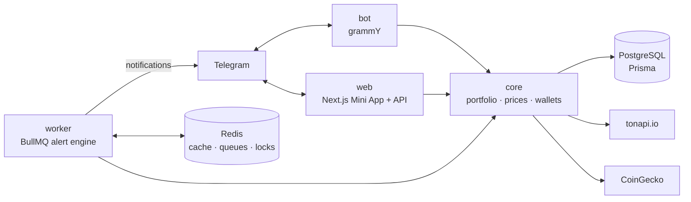

<div align="center">


# TONFOLIO

**Non-custodial TON portfolio tracker & alerts — Telegram bot + Mini App**

[](https://github.com/M1rwana12/tonfolio/actions/workflows/ci.yml)


[](LICENSE)

**Bot:** [@tonfolio_app_bot](https://t.me/tonfolio_app_bot)

</div>

---

> ### 🔒 Non-custodial. Read-only. Your keys never leave your wallet.
>
> TON Connect is used **exclusively as proof of ownership**: the wallet's ed25519
> signature (`ton_proof`) is verified **on the server** against a server-issued
> challenge. The app reads public blockchain data only — no transactions, no
> custody, no investment advice. This is the project's first principle, not a
> disclaimer.

<div align="center">

|                              Dashboard                               |                             Assets                             |                             Alerts                             |
| :------------------------------------------------------------------: | :------------------------------------------------------------: | :------------------------------------------------------------: |
|  |  |  |

</div>

## Features

- 📊 **Live portfolio dashboard** — USD/UAH value, 24h delta, 30-day history chart,
  allocation donut. Telegram theme-aware dark UI with skeleton loading and haptics
  _(Next.js 15 App Router, React 19, recharts, Tailwind CSS 4)_
- 👛 **Watch-only wallets** — track any TON address; balances and jettons synced from
  tonapi.io, addresses checksum-validated _(@ton/core)_
- 🔐 **Verified wallets** — TON Connect with server-side `ton_proof` verification:
  HMAC challenge, spec-exact message assembly, ed25519 _(@noble/curves)_
- 🔔 **Five alert types** — price above/below with **crossing semantics**, % change
  over a window, any wallet transaction, large transfers — cooldown, quiet hours and
  idempotent Redis locks _(BullMQ)_
- 🤖 **Telegram bot** — `/portfolio`, `/add_wallet`, `/alerts` with dialog flows,
  uk/en i18n checked by the compiler, per-user throttling _(grammY + conversations)_
- 🧮 **bigint money end to end** — integer minimal units in `NUMERIC(38,0)`,
  fixed-point fiat at scale 9, lossless JSON parsing; floats exist only at chart edges
- 🚀 **Fits a free-tier VM** — one production image, per-container memory caps,
  webhook mode behind Caddy with automatic HTTPS

## Architecture



```
tonfolio/
├── apps/bot          # grammY bot: dialogs, i18n, throttle, webhook/polling
├── apps/web          # Next.js Mini App + API routes (initData auth, ton_proof)
├── workers/alerts    # BullMQ jobs: prices, snapshots, alert engine
├── packages/core     # shared domain logic: portfolio, prices, wallet sync
├── packages/ton      # tonapi.io + CoinGecko clients, address utils
├── packages/db       # Prisma schema, seed
├── packages/shared   # bigint money utils, zod alert schemas, rate counter
└── deploy            # compose.prod.yml, Caddyfile, one-shot deploy script
```

## Tech stack

| Layer      | Technology                                                       |
| ---------- | ---------------------------------------------------------------- |
| Bot        | grammY (conversations, menu), webhook in prod / polling in dev   |
| Mini App   | Next.js 15 App Router, React 19, Tailwind CSS 4, recharts        |
| TMA        | `@telegram-apps/sdk-react`, server-side initData HMAC validation |
| Wallet     | `@tonconnect/ui-react`, server-side `ton_proof` (ed25519)        |
| Chain data | tonapi.io (REST, lossless bigint parsing), CoinGecko prices      |
| Data       | PostgreSQL + Prisma, Redis (BullMQ, price cache, alert locks)    |
| Quality    | TypeScript strict, ESLint 9, Vitest, Playwright, GitHub Actions  |

## Quick start

```bash
docker compose up -d          # Postgres 16 + Redis 7
cp .env.example .env          # fill in BOT_TOKEN from @BotFather
pnpm install
pnpm db:push && pnpm db:seed  # schema + demo data
pnpm --filter @tonfolio/bot dev
```

## Testing

| Layer                | What it proves                                                               | Command                                                                                 |
| -------------------- | ---------------------------------------------------------------------------- | --------------------------------------------------------------------------------------- |
| 101 unit tests (TDD) | money math, HTTP retries/429, address checksums, alert rules, throttling     | `pnpm test`                                                                             |
| Bot smoke harness    | 20-step real dialog through `bot.handleUpdate` with live tonapi/CoinGecko/DB | `pnpm --filter @tonfolio/bot exec tsx scripts/smoke.ts`                                 |
| Playwright e2e       | open Mini App → dashboard renders → create & delete an alert                 | `pnpm --filter @tonfolio/web test:e2e`                                                  |
| Live demos           | mainnet balances of any address; alert engine firing end-to-end              | `pnpm --filter @tonfolio/ton demo` · `pnpm --filter @tonfolio/alerts-worker demo:alert` |

The smoke harness has already paid for itself: it surfaced a real whale wallet
holding ~10²² minimal units of a meme jetton — beyond both IEEE double and
Postgres `int8` — which is why amounts live in `NUMERIC(38,0)`.

## Security model

- **Every API request** carries Telegram `initData`; the HMAC is validated
  server-side against the bot token (1h TTL) before any query runs.
- **Wallet verification** happens only on the server: challenge payload is
  HMAC-signed and expiring, the proof's domain and timestamp are checked, the
  signature is verified with ed25519 against the wallet's public key.
- **Rate limiting everywhere** — sliding-window limits on API routes and bot
  updates, plus hard caps: 5 watch-only wallets, 20 alerts per user.
- **Secrets** only via `.env`; the repository history contains none.

## Why these decisions

1. **Server-side `ton_proof`** — a wallet becomes `verified` only after the backend
   checks the signature, domain and timestamp. The client is never trusted.
2. **bigint + `NUMERIC(38,0)` for money** — JSON integers are parsed losslessly into
   bigint; real jetton balances overflow doubles and int8. Found by a test, not in prod.
3. **Idempotent alerts** — Redis `SET NX EX` per alert (TTL = cooldown) plus
   `lastFiredAt` in Postgres: one notification per condition across concurrent
   workers and restarts. Crossing semantics kill tick-by-tick spam.
4. **Webhook in prod, polling in dev** — zero-setup local iteration; no idle
   connections and instant updates on a 1 GB VM.
5. **60s price cache** — one batched CoinGecko call per minute serves all users;
   stored ticks are the fallback, so `/portfolio` always answers.
6. **Memory caps sized for e2-micro** — every container is capped (Postgres 190 MB,
   Redis 64 MB `allkeys-lru`, Node apps the rest + swap), so the free tier survives load.

## Production

One image (`ghcr.io/m1rwana12/tonfolio`) runs as three containers next to
Postgres, Redis and Caddy (automatic HTTPS) on a GCP e2-micro — deployed with a
single script, backed up nightly to Cloud Storage. See
[deploy/gcp-setup.md](deploy/gcp-setup.md).

---

## 🇺🇦 Українською

**TONFOLIO** — некастодіальний трекер криптопортфеля на TON: Telegram-бот + Mini App.
Ключі ніколи не покидають гаманець — TON Connect використовується лише як доказ
володіння адресою (підпис перевіряється на сервері), застосунок читає тільки
публічні дані блокчейну.

- Дашборд у реальному часі: вартість портфеля, дельта за 24 години, графік за
  30 днів, розподіл активів.
- Watch-only гаманці: стежте за будь-якою адресою TON.
- 5 типів алертів з кулдауном, «тихими годинами» та захистом від дублювання.
- Гроші — тільки цілі мінімальні одиниці (bigint / NUMERIC), жодних float.
- Понад 100 автоматичних перевірок: unit-тести (TDD), smoke-прогін бота,
  Playwright e2e, живі демонстрації на mainnet-даних.

Запуск: `docker compose up -d && pnpm install && pnpm db:push && pnpm db:seed`,
токен бота — у `.env`. Спробувати: [@tonfolio_app_bot](https://t.me/tonfolio_app_bot).

## License

[MIT](LICENSE)
