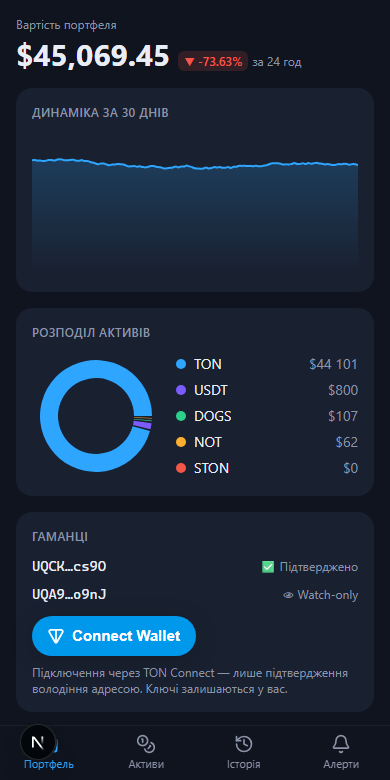
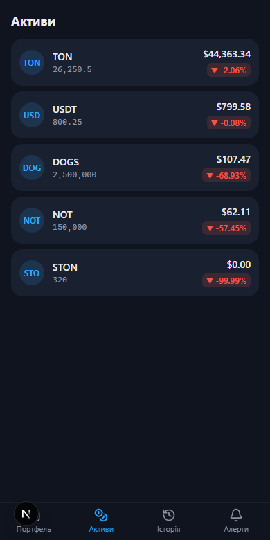
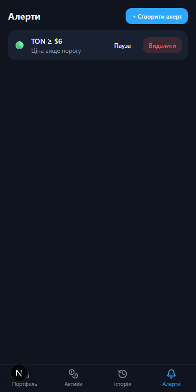
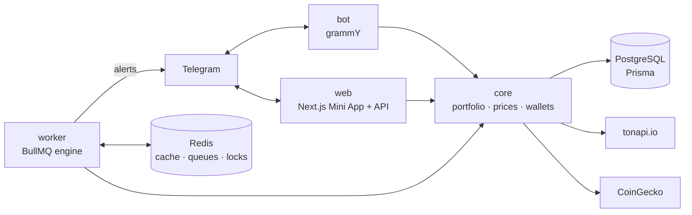

<div align="center">


# TONFOLIO

**Non-custodial TON portfolio tracker & alerts — Telegram bot + Mini App**

[](https://github.com/M1rwana12/tonfolio/actions/workflows/ci.yml)


</div>

> ## 🔒 Non-custodial. Read-only.
>
> **Your keys never leave your wallet.** TON Connect is used exclusively as proof of
> ownership — the signature is verified on the server (`ton_proof`), and the app only
> ever reads public blockchain data. No transactions, no custody, no investment advice.

| Dashboard                                | Assets                             | Alerts                             |
| ---------------------------------------- | ---------------------------------- | ---------------------------------- |
|  |  |  |

## Features

- 📊 **Portfolio dashboard** — live USD/UAH value, 24h delta, 30-day history chart and
  allocation donut (Next.js 15 + recharts, Telegram theme-aware dark UI)
- 👛 **Watch-only wallets** — track any TON address; balances and jettons synced from
  tonapi.io with checksum-validated addresses (`@ton/core`)
- 🔐 **Verified wallets** — TON Connect with **server-side `ton_proof` verification**
  (ed25519, spec-exact message assembly)
- 🔔 **Five alert types** — price above/below (crossing semantics), % change over a window,
  any wallet transaction, large transfer (BullMQ engine, cooldown + quiet hours +
  idempotent Redis locks)
- 🤖 **Telegram bot** — `/portfolio`, `/add_wallet`, `/alerts` with dialog flows
  (grammY conversations), uk/en i18n, per-user throttling
- 🧮 **bigint money everywhere** — amounts stored as integer minimal units
  (`NUMERIC(38,0)`), fixed-point fiat at scale 9; floats exist only at chart edges
- ✅ **100+ automated checks** — 101 unit tests (Vitest, TDD), a 20-step bot smoke
  harness over `handleUpdate`, Playwright e2e, live alert-engine demo

## Architecture



Monorepo (pnpm workspace): `apps/bot`, `apps/web`, `workers/alerts`,
`packages/{core,db,shared,ton}`.

## Quick start

```bash
docker compose up -d          # Postgres 16 + Redis 7
cp .env.example .env          # fill in BOT_TOKEN
pnpm install
pnpm db:push && pnpm db:seed  # schema + demo data
pnpm --filter @tonfolio/bot dev
```

Quality gates: `pnpm lint && pnpm typecheck && pnpm test && pnpm build`.
Live demos: `pnpm --filter @tonfolio/ton demo [address]` (balances of any mainnet address),
`pnpm --filter @tonfolio/alerts-worker demo:alert` (alert engine firing end-to-end).

## Why these decisions

1. **Server-side `ton_proof`** — a wallet becomes `verified` only after the backend checks
   the ed25519 signature against a server-issued HMAC challenge, the domain and the
   timestamp. The client is never trusted.
2. **bigint for money, `NUMERIC(38,0)` in Postgres** — JSON is parsed losslessly
   (integers → bigint), because real whale balances of meme jettons (~10²² minimal units)
   overflow both IEEE doubles and int8. Found by a live smoke test, not by luck.
3. **Idempotent alerts** — a Redis `SET NX EX` lock per alert (TTL = cooldown) plus
   `lastFiredAt` in Postgres: one notification per condition, even with concurrent
   workers, restarts or repeated ticks. Crossing semantics prevent tick-by-tick spam.
4. **Webhook in production, long polling in dev** — polling needs zero setup for local
   iteration; the production compose runs the bot behind Caddy as a webhook (no idle
   connections, instant updates, plays well with a 1 GB VM).
5. **Price cache with a 60s TTL** — one batched CoinGecko request per minute serves every
   user; PriceTick history doubles as a fallback when the API is throttled, so `/portfolio`
   always answers.
6. **Memory limits sized for e2-micro** — the production compose gives every container
   an explicit cap (Postgres ~200 MB, Redis 64 MB `allkeys-lru`, Node processes get the
   rest of 1 GB + swap), so the free-tier VM stays alive under load.

---

## 🇺🇦 Коротко українською

**TONFOLIO** — некастодіальний трекер криптопортфеля на TON: Telegram-бот + Mini App.
Ключі ніколи не покидають ваш гаманець: TON Connect використовується лише як доказ
володіння адресою (підпис перевіряється на сервері), застосунок читає тільки публічні
дані блокчейну.

- Дашборд: вартість портфеля в реальному часі, дельта за 24 години, графік за 30 днів,
  розподіл активів.
- Watch-only гаманці: стежте за будь-якою адресою TON (баланси й джетони з tonapi.io).
- 5 типів алертів: ціна вище/нижче порогу, зміна на N% за період, будь-яка транзакція,
  великий переказ — з кулдауном, «тихими годинами» та захистом від дублювання.
- Гроші — тільки цілі мінімальні одиниці (bigint / NUMERIC), жодних float.
- Понад 100 автоматичних перевірок: unit-тести (TDD), smoke-прогін бота, Playwright e2e,
  жива демонстрація спрацювання алерту.

Запуск: `docker compose up -d && pnpm install && pnpm db:push && pnpm db:seed`,
токен бота — в `.env`.

## License

[MIT](LICENSE)
